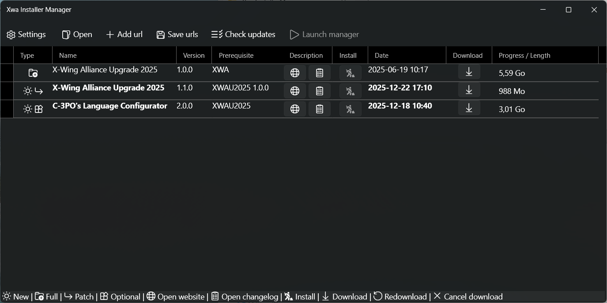

# XwaInstallerManager

X-Wing Alliance Installer Manager is a tool to easily download and install XWA installers.

XwaInstallerManager runs on Windows 32/64 bits with the .NET framework 4.8.
(Windows 7, Windows 8, Windows 10, Windows 11, or superior)

# Usage

Place the "XwaInstallerManager" directory anywhere you want, but not in a XWA installation directory.
Launch "XwaInstallerManager.exe".
The tool will ask where is the directory which contain your XWA vanilla (unmodified) installation and where you want to install the XWA installers.

# Download

[XwaInstallerManager.zip](https://github.com/JeremyAnsel/XwaInstallerManager/raw/main/zip/XwaInstallerManager.zip)
